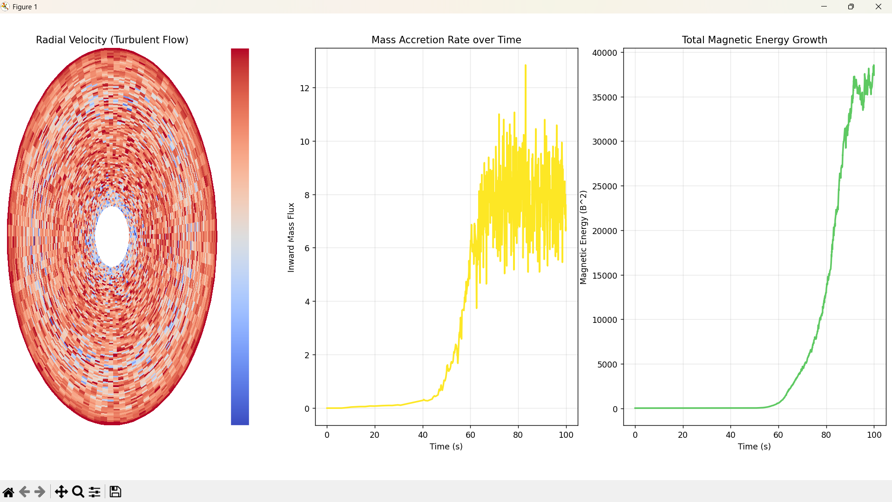
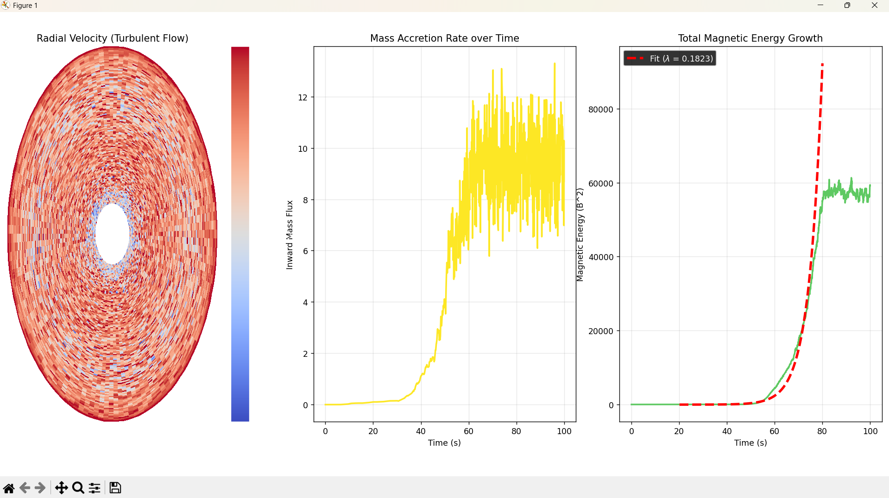
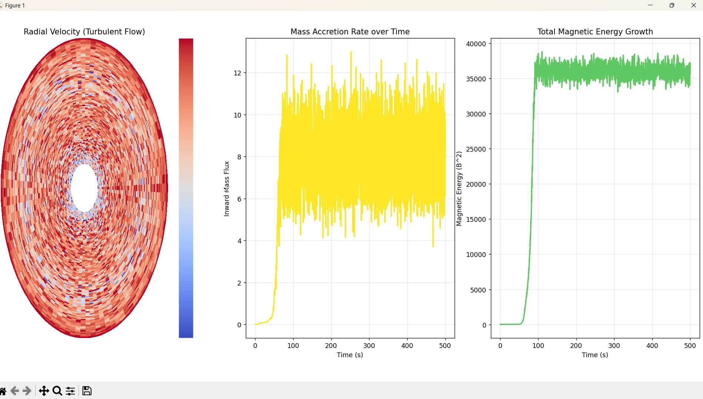
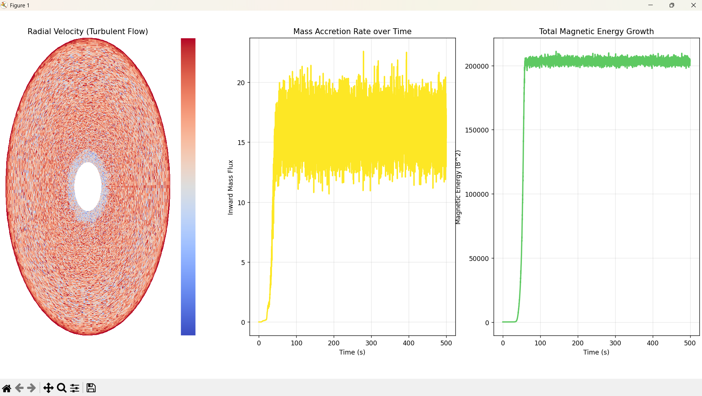

# 2D-MHD-MRI-Simulation
A Python-based 2D Magnetohydrodynamic simulation of the Magneto-Rotational Instability using Constrained Transport.
## 🧮 The Governing Physics (Equations)

This project does not rely on any pre-built physics engine. Instead, it directly implements the core equations of ideal Magnetohydrodynamics (MHD) in a 2D setting to model the behavior of a magnetized accretion disk.

---

### 1. Differential Rotation (The Driver of MRI)

The simulation is initialized with a Keplerian angular velocity profile, representing a disk orbiting a central mass. Since the inner regions rotate faster than the outer regions, magnetic field lines are continuously stretched and sheared — this differential rotation is what drives the instability:

Ω(R) ∝ R^(-3/2)

---

### 2. Induction Equation (Magnetic Field Evolution)

To track how the magnetic field evolves with the flow, the simulation solves the induction equation. This captures how fluid motion stretches and amplifies the magnetic field:

∂B/∂t = ∇ × (v × B)

---

### 3. Constrained Transport (Keeping the Physics Clean)

A key challenge in MHD simulations is avoiding non-physical magnetic monopoles caused by numerical errors.  

To address this, the solver uses a **Constrained Transport (CT)** scheme on a staggered grid, ensuring that:

∇ · B = 0  

is preserved throughout the simulation to machine precision.

---

### 4. Lorentz Force (Feedback on the Fluid)

As magnetic field lines stretch, they develop tension that feeds back into the fluid motion. This interaction redistributes angular momentum and enables accretion:

F_mag = (∇ × B) × B

---

## 📸 Milestone Visualizations & Physical Interpretation

To understand how the system evolves, the simulation was analyzed across different time scales and resolutions. Below is a breakdown of the key stages:

---

### 1. Early-Time Run (~100s) — Linear Growth Phase  

**What is happening:**  
This stage captures the initial growth of the instability.

**Physical interpretation:**  
The magnetic energy begins to grow exponentially as small perturbations are amplified by differential rotation. The radial velocity field starts deviating from zero, indicating the early influence of magnetic tension on the flow.

---

### 2. Growth Rate Analysis — Curve Fitting  

**What is happening:**  
A log-linear fit is applied to the exponential growth phase of magnetic energy.

**Physical interpretation:**  
Fitting the relation (E ∝ e^(γt)) yields a growth rate of:

γ ≈ 0.182

Since energy scales as E ∝ B², this corresponds to a magnetic field growth rate consistent with theoretical MRI expectations (~0.75Ω).  
Given that Ω varies radially in the simulation, this value represents an effective global growth rate across the disk.

---

### 3. Long-Time Run (~500s) — Non-Linear Saturation  

**What is happening:**  
The system transitions from exponential growth to a turbulent steady state.

**Physical interpretation:**  
Magnetic energy reaches a saturation level as magnetic tension balances further amplification. The flow becomes fully turbulent, and the radial velocity field develops complex, chaotic structures. This turbulence is responsible for angular momentum transport and sustained accretion.

---

### 4. High-Resolution Run (256 × 256) — Convergence Check  

**What is happening:**  
A higher-resolution simulation is used to verify the robustness of the results.

**Physical interpretation:**  
The overall magnetic energy evolution remains consistent with lower-resolution runs, indicating stable large-scale behavior. At the same time, finer turbulent structures become visible, suggesting that the solver captures small-scale dynamics with low numerical dissipation.

---

## 🧠 Summary

Across all stages, the simulation reproduces the key physical signatures of magnetorotational instability:

- exponential magnetic field amplification  
- transition to turbulence  
- sustained accretion behavior  
- consistent behavior across resolutions  

These results indicate that the model captures the essential physics of MRI in a Keplerian disk.

This project started as a personal attempt to understand how MRI works beyond equations — and evolved into a simulation that reproduces its key physical behavior.
